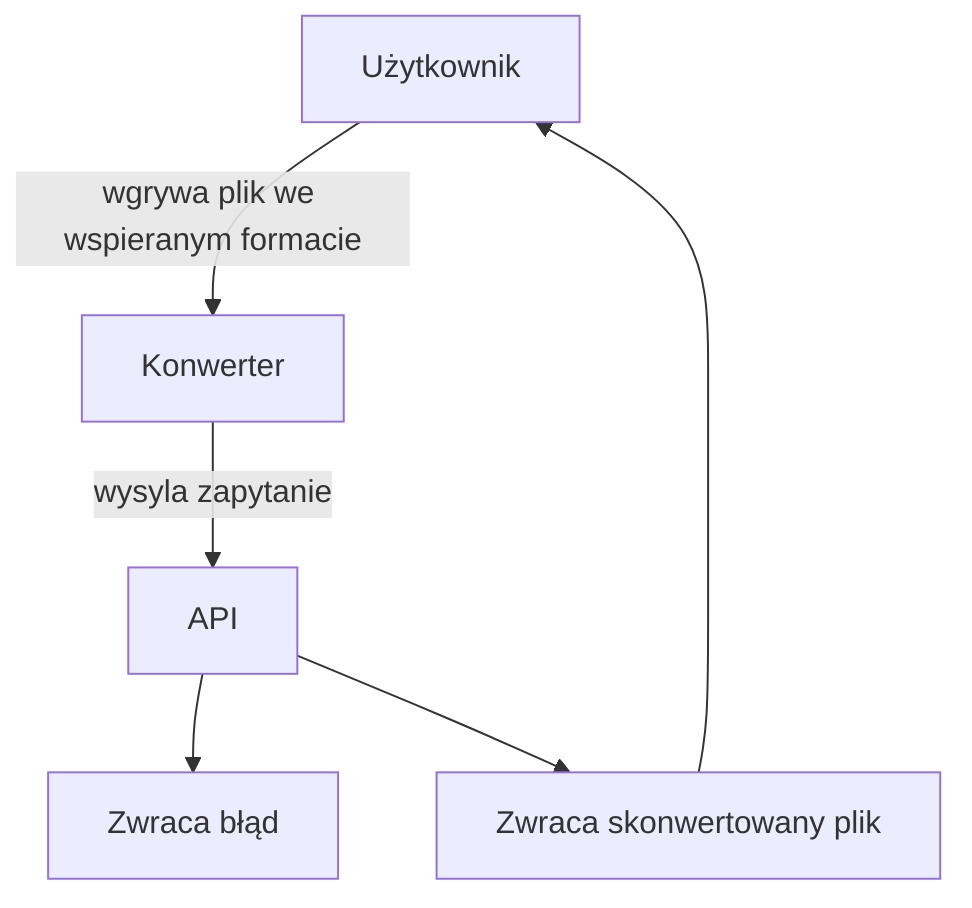

# Dokumentacja

## Członkowie zespołu


### Zestaw pytań

| Pytanie      | Odpowiedź                  | Uwagi|
| ------------- |:-------------------:| -----|
| Jakie formaty będą obsługiwane?   |JPEG,PNG,GIF,MP3,WAV,FLAC,PM4,MOV |  |
| Jak powinnien wyglądać interfejs gradiczny?   | poniżej zamieszczony wygląd*        |   |
| Jaki rozmiar plików jest dopuszczalny? | 200MB            |     |
| Maksymalny czas przetwarzania? | 5 minut | Bez znaczącej utraty jakości < 20%
| Jaki rodzaj platformy? | Desktop lub web |
| Czy wymagamy backupu plików na serverze? | Nie. | Nowy plik jako kopia
|Jaki język powinnien być na interfejsie graficznym? | Polski |

**Czy wszystkie wymagania klienta są możliwe do spełnienia? TAK**

### Interfejs*


### Format Danych wejściowych
| Plik      | format wejściowy/wyjściowy | Control-warunek                  | Report|
| ------------- |-|:-------------------:| -----|
|plik dźwiękowy|MP3, WAV, FLAC| Plik musi ważyć conajwyżej 200MB | Plik sformatowany
|plik wideo|MP4, MOV| Plik musi ważyć conajwyżej 200MB | Plik sformatowany
|plik graficzny|JPG, PNG, GIF| Plik musi ważyć conajwyżej 200MB | Plik sformatowany

### Schemat przykładu użycia



### Diagram Sekwencyjny UML
```mermaid
sequenceDiagram
    participant User as Użytkownik
    participant UI as Interfejs graficzny
    participant API as API
    participant Converter as Moduł Konwersji
    participant File as Plik wyjściowy

    User->>UI: Wgrywa plik i wybiera format
    UI->>API: Wysyła żądanie konwersji pliku
    API->>Converter: Przekazuje plik do konwersji
    Converter-->>API: Zwraca skonwertowany plik
    API-->>UI: Przekazuje skonwertowany plik
    UI-->>User: Umożliwia pobranie pliku
 ```
### Projekt Architektury opracowanego systemu
```mermaid
 graph TD;
subgraph Koniec - Wyjście
        Skonwertowany_Plik[Skonwertowany plik] --> Raport[Generowanie raportu]
    end
    

    subgraph Przetwarzanie
        Walidacja[Walidacja pliku] --> Konwersja[Przetwarzanie przez moduł konwersji]
    end

    subgraph Start - Wejście
        Wgrywanie_Pliku[Wgrywanie pliku] --> Wybór_Formatu[Wybór formatu docelowego]
    end
```
### Sugerowane języki implementacji
Python, JavaScript

Uzasadnienie: Python został wybrany do backendu ze względu na swoją prostotę oraz łatwość tworzenia skalowalnych API. JavaScript z frameworkami jak React.js jest idealny do tworzenia dynamicznych, interaktywnych interfejsów użytkownika w aplikacji typu SPA. Te języki zapewniają wydajność oraz łatwą integrację.
