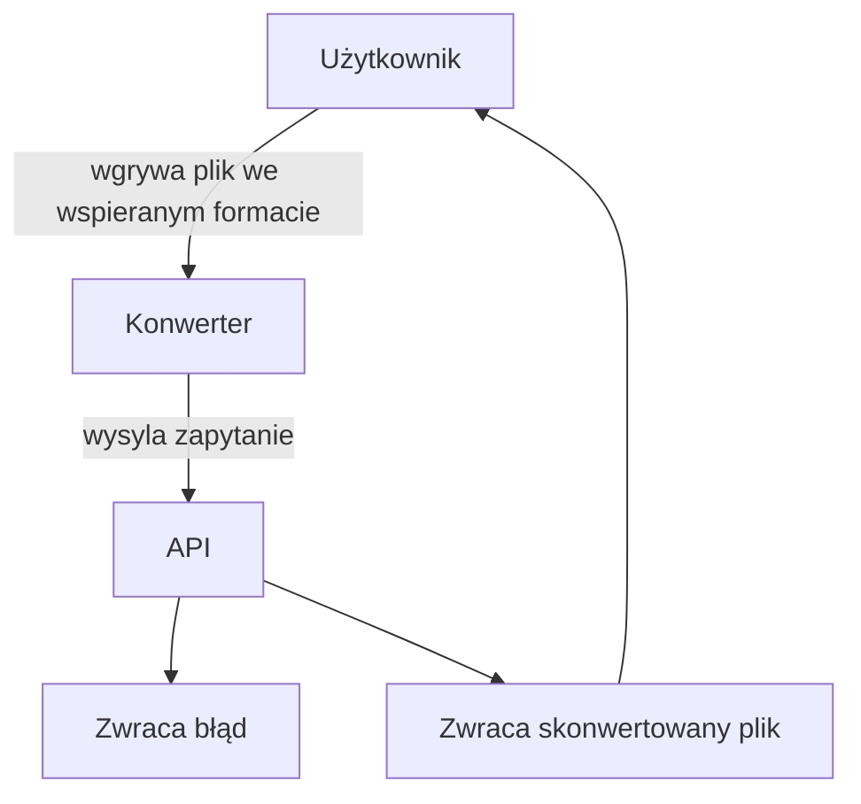

# Dokumentacja

## Członkowie zespołu

### Zestaw pytań

| Pytanie      | Odpowiedź                  | Uwagi|
| ------------- |:-------------------:| -----|
| Jakie formaty będą obsługiwane?   |JPEG,PNG,GIF,MP3,WAV,FLAC,PM4,MOV |  |
| Jak powinnien wyglądać interfejs gradiczny?   | poniżej zamieszczony wygląd*        |   |
| Jaki rozmiar plików jest dopuszczalny? | 200MB            |     |
| Maksymalny czas przetwarzania? | 5 minut | Bez znaczącej utraty jakości < 20%
| Jaki rodzaj platformy? | Desktop lub web |
| Czy wymagamy backupu plików na serverze? | Nie. | Nowy plik jako kopia
|Jaki język powinnien być na interfejsie graficznym? | Polski |

**Czy wszystkie wymagania klienta są możliwe do spełnienia? TAK**

### Interfejs

### Format Danych wejściowych
| Plik      | format wejściowy/wyjściowy | Control-warunek                  | Report|
| ------------- |-|:-------------------:| -----|
|plik dźwiękowy|MP3, WAV, FLAC| Plik musi ważyć conajwyżej 200MB | Plik sformatowany
|plik wideo|MP4, MOV| Plik musi ważyć conajwyżej 200MB | Plik sformatowany
|plik graficzny|MP3, WAV, FLAC| Plik musi ważyć conajwyżej 200MB | Plik sformatowany

### System

